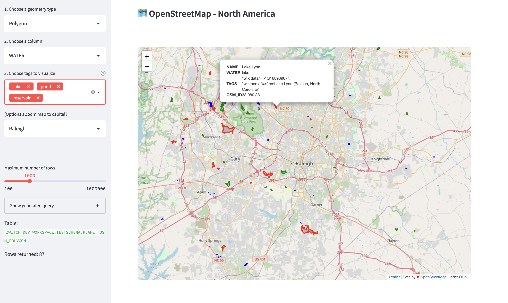

# Streamlit-Folium + Snowflake + OpenStreetMap

This streamlit app demonstrates the power of Snowflake Geospatial data types and queries combined with Streamlit and Streamlit-Folium for building an interactive geospatial app.

The dataset for this app comes from [OpenStreetMap](https://planet.openstreetmap.org/) and is stored in Snowflake, and it includes Point, Line and Polygon data types.

The app allows you to query and visualize any of these datasets, filtering by data type and metadata values via selectors in the sidebar, as well as filtering geographically via an interactive map with [streamlit-folium](https://github.com/randyzwitch/streamlit-folium/).

> Note: If you would like to use this app with your own geospatial dataset, provide your credentials in a a `.streamlit/secrets.toml` in [this format](https://docs.streamlit.io/knowledge-base/tutorials/databases/snowflake#add-username-and-password-to-your-local-app-secrets).
